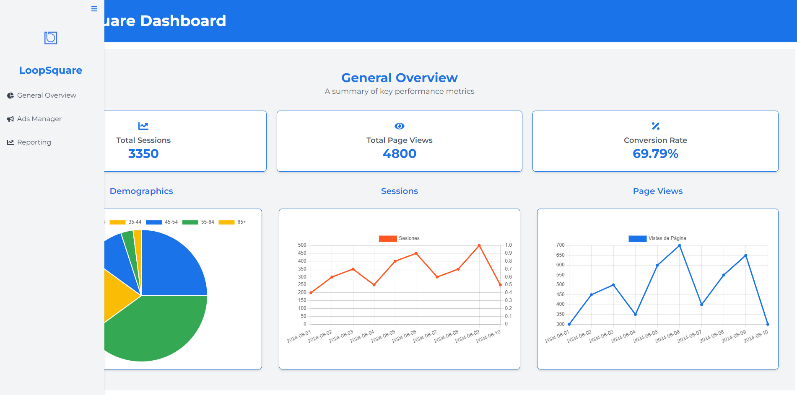

## Informacion General

## Despliegue en PRD
- [https://admira-dashboard.vercel.app/](https://admira-dashboard.vercel.app/)


## Elecciones de diseño

- La configuracion de colores primarios, secundarios, etc. Se encuentra en /tailwind.config.ts

- Se escogieron los siguientes colores para el dashboard:
    - Primario: #1A73E8
    
    - Secundario: #4B5563
     
    - Acento: #FF5722
    
    - Background: #F3F4F6
    

### Requisitos Previos

- Node.js v14 o superior
- npm o yarn

### Tecnologias

- NextJS 
- TypeScript
- ReactJS 
- Tailwind CSS
- ChartJS

## Primeros Pasos

Para correr el proyect en local/dev:

```bash
npm run dev
# or
yarn dev
# or
pnpm dev
# or
bun dev
```

El proyecto abrira en: [http://localhost:3000](http://localhost:3000).

## Documentacion

- **Next.js**
  - [Next.js Documentation](https://nextjs.org/docs)

- **TypeScript**
  - [TypeScript Documentation](https://www.typescriptlang.org/docs/)

- **ReactJS**
  - [ReactJS Documentation](https://reactjs.org/docs/getting-started.html)

- **Tailwind CSS**
  - [Tailwind CSS Documentation](https://tailwindcss.com/docs)

- **Chart.js**
  - [Chart.js Documentation](https://www.chartjs.org/docs/)

## Pasos para hacer un deploy en Vercel

### 1. Crear una cuenta en Vercel
- Si aún no tienes una cuenta, ve a [Vercel](https://vercel.com/) y regístrate. Puedes usar tu cuenta de GitHub, GitLab o Bitbucket para facilitar el proceso.

### 2. Vincular tu proyecto
- Una vez que hayas iniciado sesión en Vercel, haz clic en **"New Project"**.
- Selecciona el repositorio donde tienes tu proyecto (GitHub, GitLab, o Bitbucket).
- Vercel detectará automáticamente los frameworks que estás utilizando.

### 3. Configurar el proyecto
- Revisa la configuración predeterminada que Vercel ha detectado. Puedes configurar variables de entorno si tu proyecto las necesita.
- Asegúrate de que la configuración del build (**build command**) y la carpeta de salida (**output directory**) sean correctas. Para proyectos de Next.js, la carpeta de salida es usualmente `.next` (y Vercel lo detecta automáticamente).

### 4. Desplegar el proyecto
- Haz clic en **"Deploy"** para iniciar el despliegue.
- Vercel comenzará el proceso de construcción y despliegue de tu proyecto.
- Una vez que el proceso se complete, recibirás un enlace con el nombre del dominio que Vercel ha asignado a tu proyecto.

### 5. Verificar el despliegue
- Una vez desplegado, visita el enlace proporcionado por Vercel para verificar que tu proyecto está funcionando correctamente.

### 6. Actualizar el proyecto
- Cada vez que hagas un push a la rama principal del repositorio (o la rama que hayas configurado para el despliegue), Vercel automáticamente construirá y desplegará la nueva versión de tu proyecto.

